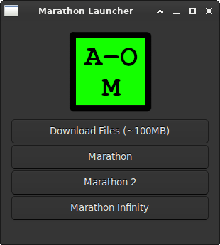

# AlephOne-Launcher

## A graphical Launcher for AlephOne's Marathon engine for Linux.



The launcher is a program written in Vala. It will download and unzip the marathon game files to your `~/.local/share/marathon/` folder and give you buttons for each game. It comes with a .desktop file so you never have to open the command line after you install it.

### Flatpak Installation

Runtimes from [Flathub](https://flatpak.org/setup/) are required. If you have flatpak set up you likely have these installed already.

```
sudo flatpak remote-add --if-not-exists alephonelauncher https://elagost.com/flatpak/repo_launcher.flatpakrepo
sudo flatpak install com.elagost.alephone-launcher -y
```
The Flatpak build includes the game engine, so you don't have to install or build it separately.

### Known Issues

These just effect the launcher, not the game as a whole.

- The launcher locks up when downloading files. That's not something I've figured a way around yet.
- The buttons don't update when the download is complete.
- The way I'm handling icon display is bad (icons will frequently be broken) but doesn't effect functionality.

### Building from source:

Build Dependencies:

- gtk4 or gtk3 dev libraries
- vala compiler (`valac`)
- make

Runtime dependencies:

- gtk4 or gtk3
- unzip
- wget
- The launcher doesn't include the game engine by default. You'll need to build the [alephone engine](https://github.com/Aleph-One-Marathon/alephone) from source too.


If you have any suggestions please let me know!

Eventual goals:

- kill the .sh file; move functionality into the launcher itself (done!)
- gtk4 port (done!)
- flatpak
- better Makefile
